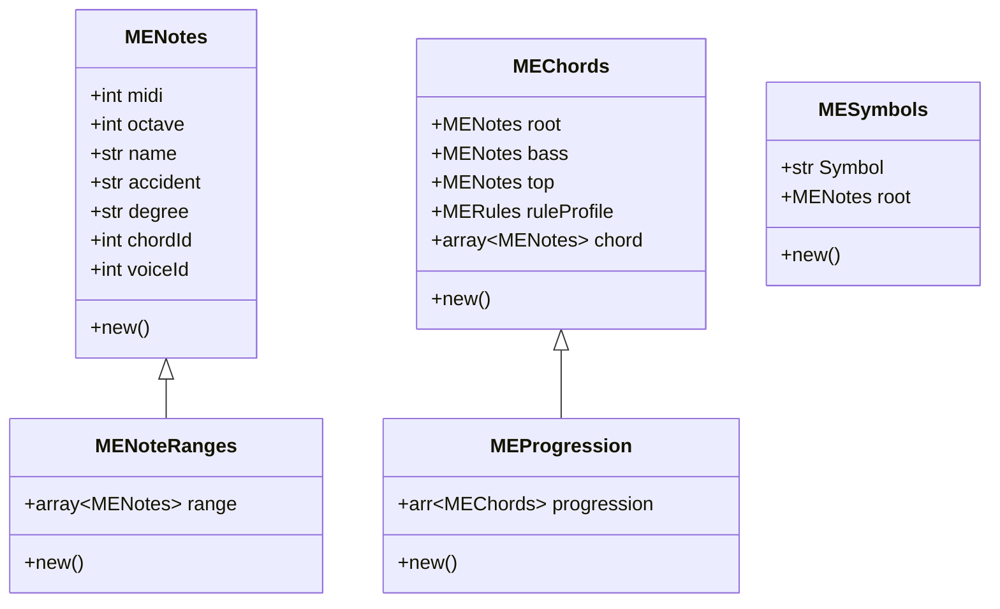

```mermaid
classDiagram
    MENotes <|-- MENoteRanges
    MEChords <|-- MEProgression
    class MENotes {
        +int midi
        +int octave
        +str name
        +str accident
        +str degree
        +int chordId
        +int voiceId
        +new()
    }

    class MENoteRanges {
        +array~MENotes~ range
        +new()
    }

    class MESymbols {
        +str Symbol
        +MENotes root
        +new()
    }

    class MEChords {
        +MENotes root
        +MENotes bass
        +MENotes top
        +MERules ruleProfile
        +array~MENotes~ chord
        +new()
    }

    class MEProgression {
        +arr~MEChords~ progression
        +new()
    }
```