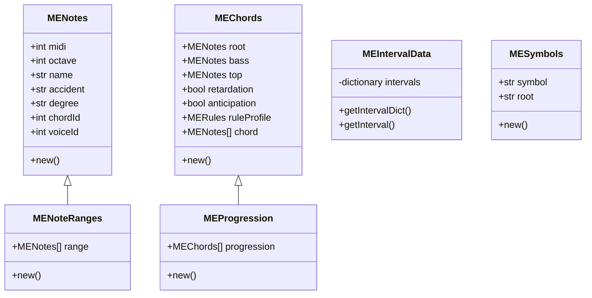

```mermaid
classDiagram
    MENotes <|-- MENoteRanges
    MEChords <|-- MEProgression
    class MENotes {
        +int midi
        +int octave
        +str name
        +str accident
        +str degree
        +int chordId
        +int voiceId
        +new()
    }

    class MENoteRanges {
        +MENotes[] range
        +new()
    }

    class MEIntervalData {
        -dictionary intervals
        +getIntervalDict()
        +getInterval()
    }

    class MESymbols {
        +str symbol
        +str root
        +new()
    }

    class MEChords {
        +MENotes root
        +MENotes bass
        +MENotes top
        +bool retardation
        +bool anticipation
        +MERules ruleProfile
        +MENotes[] chord
        +new()
    }

    class MEProgression {
        +MEChords[] progression
        +new()
    }
```