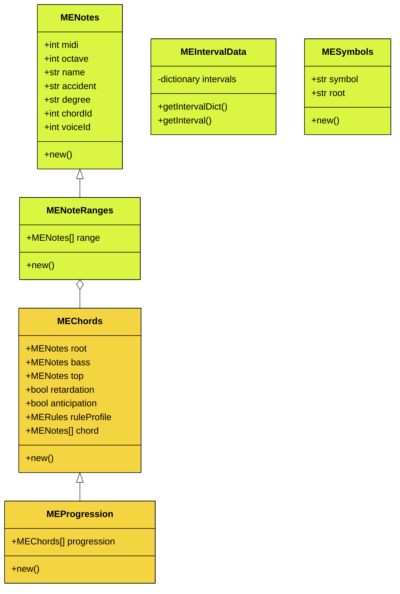

# Music Engine

A dynamic chord library for Harmonizer 02, implemented in SuperCollider

## Rules

* Root/octave can't be of any other type other than Perfect.
* Chord note number may range from two to seven.
* Degree clashes are not allowed (m2/M2, P4/A11, etc.).
* Note clashes are not allowed (m3/A9, A4/d5, etc.).
* Diminished seconds and augmented sevenths are not allowed, since they clash with the root.

## Interval Types

Depending on the degree, an interval may be diminished, minor, perfect, major or augmented. Represented, respectively, with: d, m, P, M, A.

## Allowed Intervals

| **Degree** | **Type** |
|----------|-----------------------|
| 2nd/9th; 3rd/10th; 6th/13th; 7th/14th | d, m, M, A |
| 4th/11th; 5th/12th | d, P, A |

## Class Diagram

