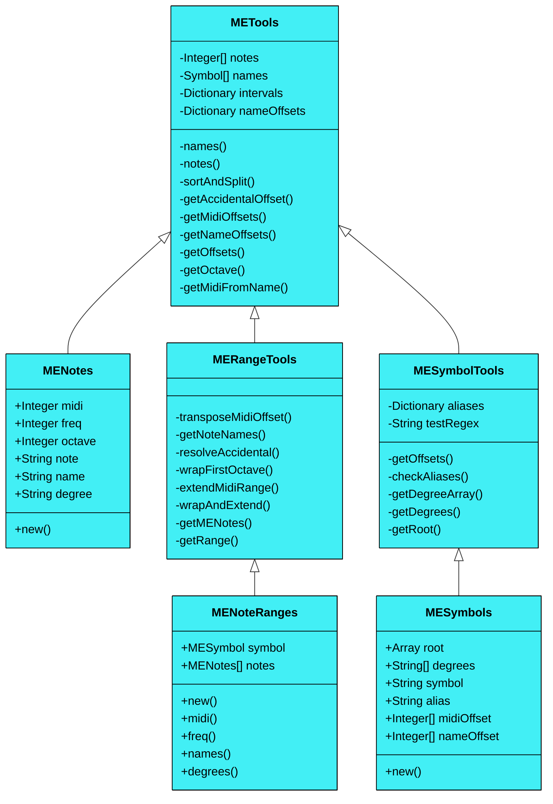

> [!WARNING]
> This project is under development and is not yet functional. A such, this README file is currently serving the purpose of a note-pad. Stating goals, guidelines and ideas to be implemented. Information on this page may change, as the project moves forward.

# Music Engine

A dynamic music library for Harmonizer 02, implemented in SuperCollider.

---

## Rules

* Unison and octave are not allowed when specifying chord degrees.
* Chord note number may range from two to ~~seven~~ twelve.
* ~~Degree clashes are not allowed (m2/M2, P4/A11, etc.).~~
* Note clashes are not allowed (m3/A9, A4/d5, etc.).
* Diminished seconds and augmented sevenths are not allowed, since they clash with the root.
* Roots with double sharps or flats are not allowed, other than that, any chord formation can be written over any root, provided non of the chord notes reaches a forth flat/sharp (B# or C, F# or Gb, F or E#, etc.). MusicEngine should be able to handle enharmonics accordingly and name all notes correctly.

## Allowed Intervals

Depending on the degree, an interval may be diminished, minor, perfect, major or augmented. Represented, respectively, with: d, m, P, M, A.

| **Degree** | **Type** |
|----------|-----------------------|
| 2nd/9th | m, M, A |
| 7th/14th | d, m, M |
| 3rd/10th; 6th/13th | d, m, M, A |
| 4th/11th; 5th/12th | d, P, A |

## Verbose Syntax

Chords may be described by:
* Referencing the root note (A-G), with or without accidentals (#/b)
* using a letter to describe degree type (d, m, P, M, A) and
* using an integer to represent degree (2-7, 9-14)

### Common Chord Examples

```supercollider
"Dbm3P5"           // Minor triad, over Db
"FM3P5m7"          // Dominant seventh chord, over F
"BbM3P5M7M9P11M13" // Major seventh chord with added ninth, eleventh and thirteenth, over Bb
"GM2P5m7"          // Sus2 dominant seventh chord, over G
```

### Less Common Chord Examples

```supercollider
"EbP4m7"          // Quartal triad, over Eb
"D#P5M9"          // Quintal triad, over D#
"Ed3d5d7"         // German sixth in root position, over E
```

## Chord Symbol Aliases

There's a chord symbol detection system implemented on top of the verbose syntax system. MusicEngine, when parsing a chord symbol, will first check the aliases dictionary to see if it finds a match, if not it will parse the degrees. A list of recognized symbols can be find in the projects [wiki](https://github.com/iamsiriil/sc_musicengine/wiki/Chord-Symbols).

## Validity Tests

* Contains root at the start (A-G, #/b)
* Contains only the numbers 2-7, 9-14
* Contains only the letters d, m, P, M, A
* No consecutive numbers without type descriptor
* No consecutive letters without numbers
* Numbers are prefixed with a valid descriptor, given the degree they represent

## Class Diagram

