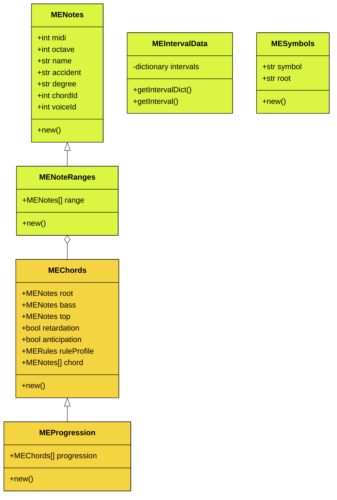

# Music Engine

A dynamic chord library for SuperCollider

## Something

* Interval clashes are not allowed (m2/M2, P4/A11, etc.)
* Note clashes are not allowed (m3/A9, A4/d5, etc.)
* Diminished seconds and augmented sevenths are not allowed, since they clash with the root.

