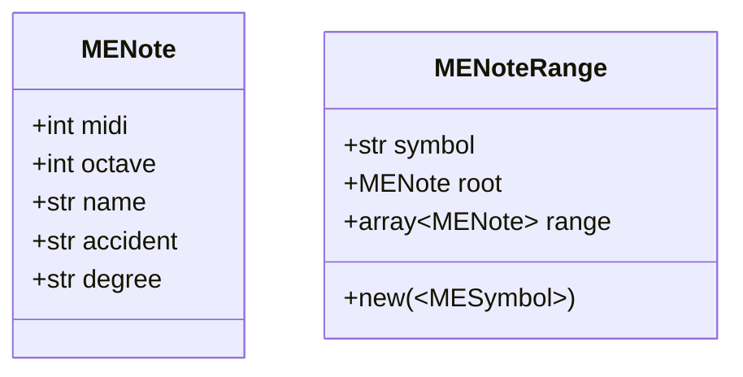

```mermaid
classDiagram
    class MENote {
        +int midi
        +int octave
        +str name
        +str accident
        +str degree
    }

    class MENoteRange {
        +str symbol
        +MENote root
        +array~MENote~ range
        +new(~MESymbol~)
    }
```